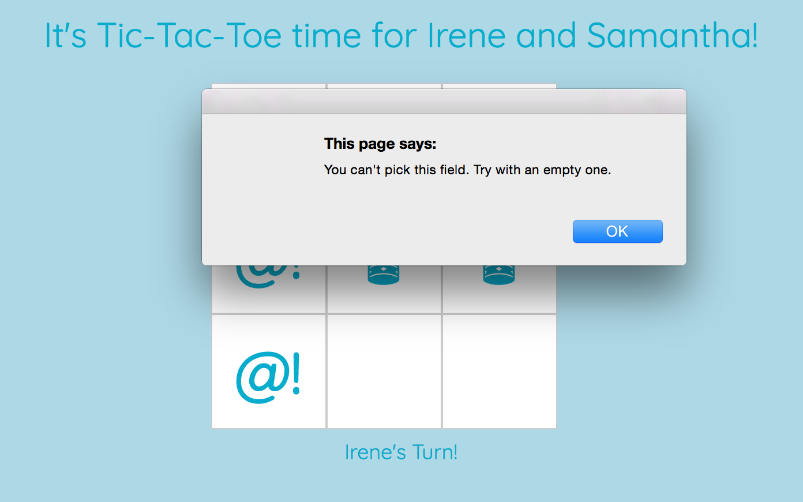

# Minimax Tic-Tac-Toe

_Hello,
I’m the project manager at a Command Line Games, Inc. I have a small dev team and we hired a consulting company to help us build an app that will feature a number of games for children, one being Tic Tac Toe...._

Follow the brief and improve the game.

### Specifications

#### Starting point

- There are two players in the game (X and O)
- A turn ends when a player claims a field
- A player can claim a field if it is not already taken
- Players take turns until the game is over
- A player wins if they claim all the fields in a row, column or diagonal
- A game is over if a player wins
- A game is over when all fields are taken
- Players can enter their names

#### Client's specifications

1. The game must handle bad user input
2. The game must provide better feedforward and feedback messages to the user
3. The user can choose the game type:
   * human vs human
   * human vs computer
   * computer vs computer
4. A player can choose her symbol (beyond X and O)
5. Players can decide who moves first
6. The computer is unbeatable

**Spec n.1**<div style="text-align:center;"></div>   

**Spec n.3**<div style="text-align:center;"></div>

**Spec n.4**<div style="text-align:center;">
_Note: the input field doesn't allow more than 2 digits._</div>

**Spec n.5**<div style="text-align:center;"></div>

**Spec n.6**<div style="text-align:center;"></div>

### Technology

- jQuery
- Javascript
- HTML5/CSS
- Bootstrap
- Testing Framework : **Jasmine**


To run the test suite:
```
$ git clone git@github.com:nenoch/minimax-tic-tac-toe.git
$ cd minimax-tic-tac-toe
// open SpecRunner.html in the browser

```
### Play Tic-Tac-Toe online

https://unbeat-tic-tac-toe.herokuapp.com/

### How to play Tic-Tac-Toe locally

```
$ git clone git@github.com:nenoch/minimax-tic-tac-toe.git
$ cd minimax-tic-tac-toe
// open index.html in the browser

```
#### Approach

**Challenges:**
- Refactor a previous tic-tac-toe game to include new specifications.
- Build the logic behind the unbeatable computer
- DOM click events triggered by the computer

Also, I decided to build the game as a SPA without a framework.

I started refactoring from the logic, using TDD to adapt the game to the new specifications. I gave functions expressive names corresponding to specifications (e.g. ```firstMover()```) and with a clear separation of concerns.

Introducing the computer as a player was challenging both from the logic and the interface perspective. I implemented the minimax recursive algorithm to allow the Computer to choose the best move, making it unbeatable. Its decision-making process is based on alternate moves, assigning a different score depending on whether the advantage is on the computer or the opponent side, so it was important to have a universal way for the game to handle player's input (```makeAmove()``` in Game).

I applied ducktyping to the players of the Game so that it doesn't matter whether they are instances of User or Computer. They both have a name and a symbol and click to select their chosen move. Also, the computer's click has a timeout of 1 second that gives the user the feeling of the machine thinking, making the computer vs computer game more enjoyable.

As regards the interface, index.js is the entry gate to the game, that then calls functions with expressive names from UI-controller.js making the flow of the game clear and readable.

_Note: I paid special attention to write clear bullet points commits throughout the whole development._

**Reflections**

Looking back, I think it would be interesting to rewrite this application as a Node.js app built on a clearer MVC model and with a framework, or with React and Redux. Especially for documentation and tests coverage.

#### Main Minimax Resources

[VIDEO | Harvard’s CS50 explanaition of the concept of Recursion](https://www.youtube.com/watch?v=VrrnjYgDBEk)   
[GeeksForGeeks | Minimax Algorithm in Game Theory](http://www.geeksforgeeks.org/minimax-algorithm-in-game-theory-set-3-tic-tac-toe-ai-finding-optimal-move/)   
[RECURSION 201: MINIMAX, TIC TAC TOE, & AN UNBEATABLE AI](http://www.shei.io/recursion-minimax-algorithm/)
