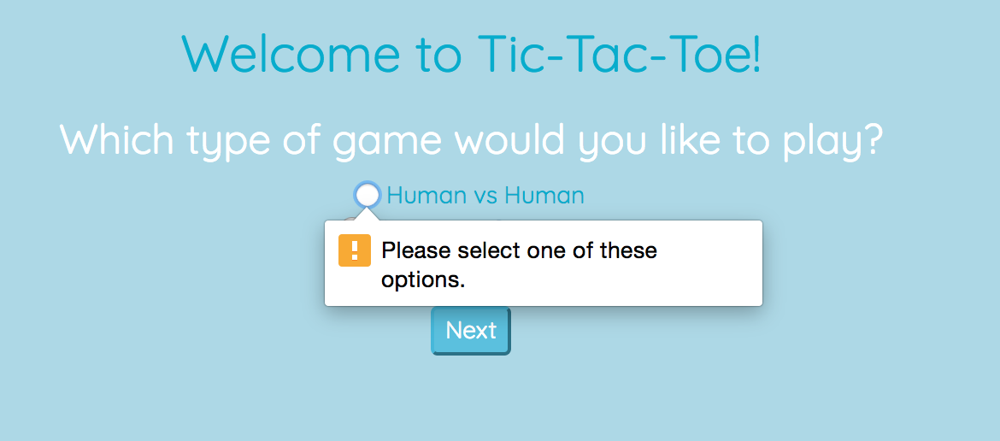
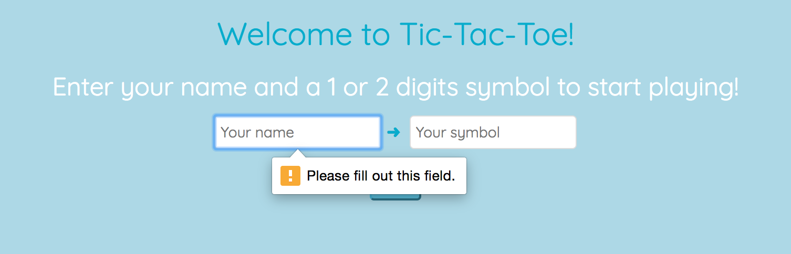
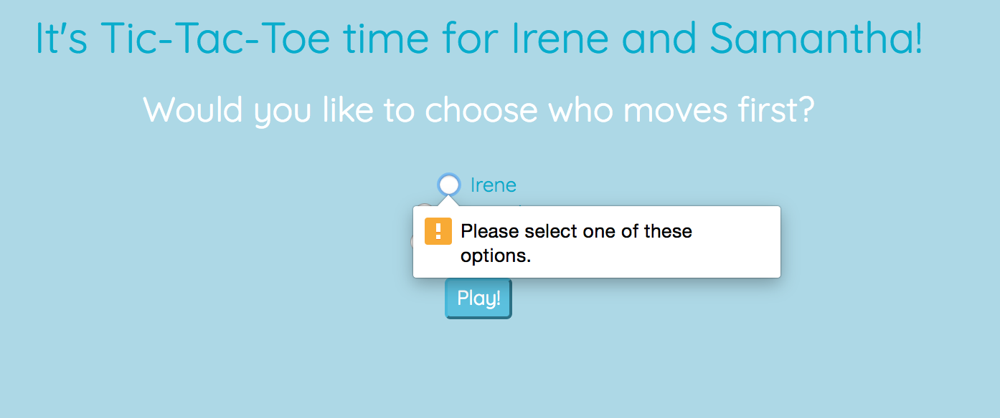
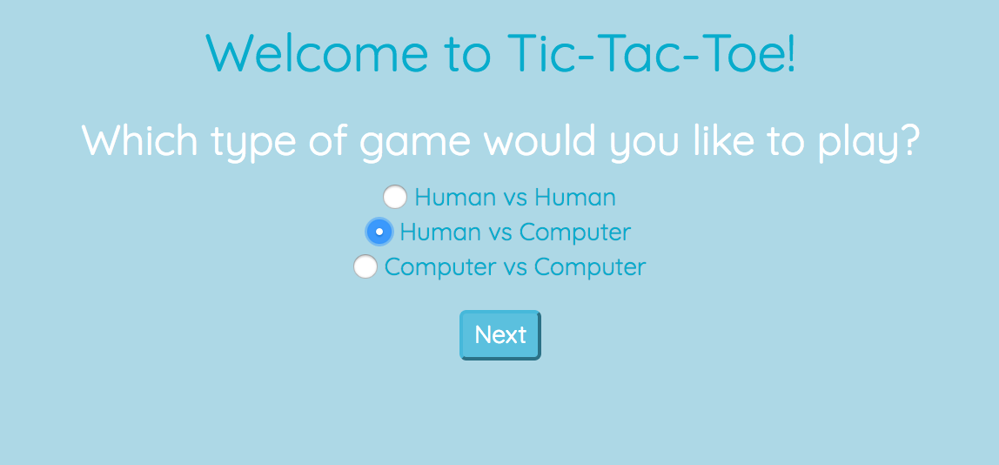
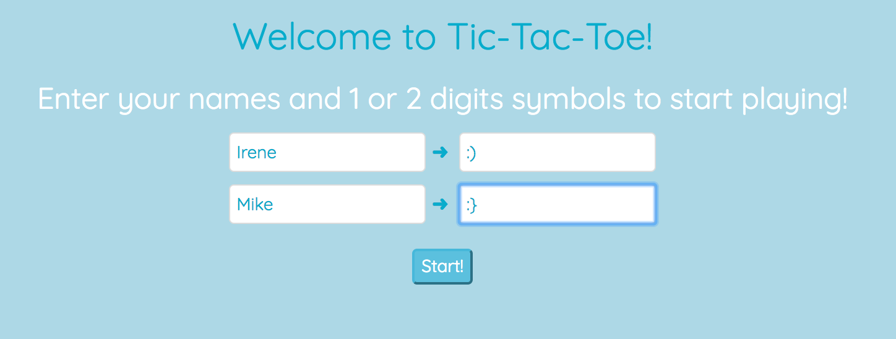
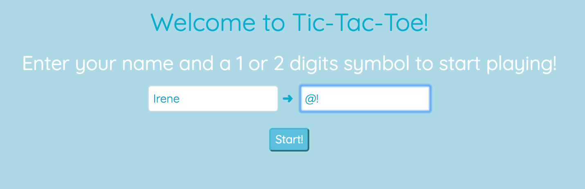
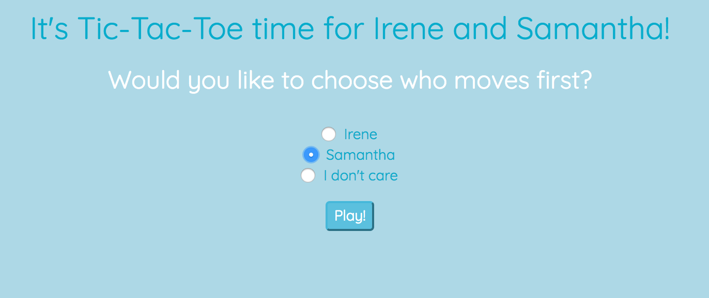
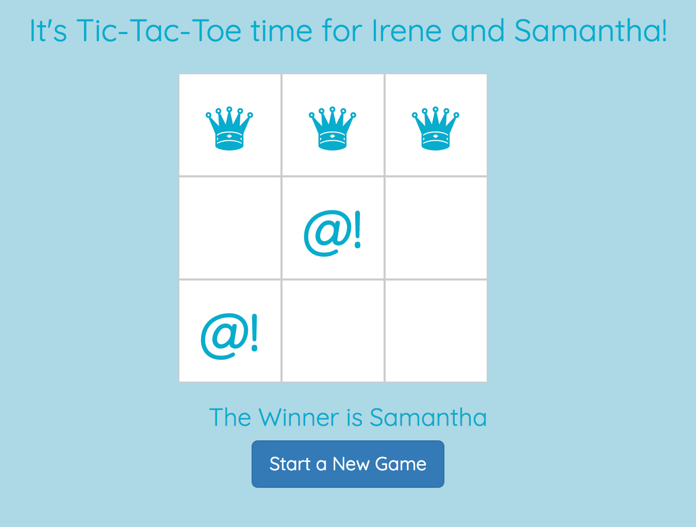
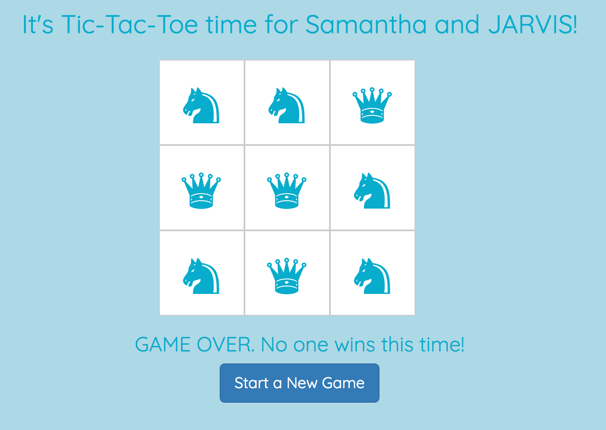
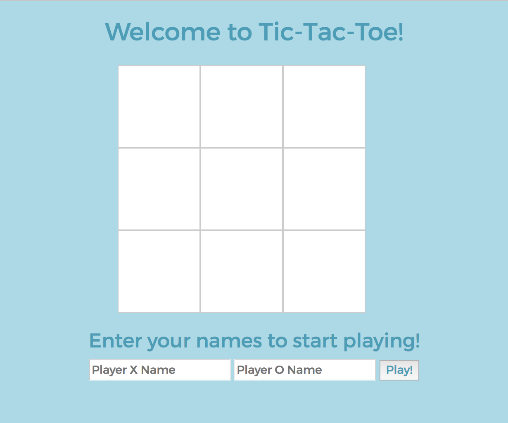

# Minimax Tic-Tac-Toe

_Hello,
I’m the project manager at a Command Line Games, Inc. I have a small dev team and we hired a consulting company to help us build an app that will feature a number of games for children, one being Tic Tac Toe...._

Follow the brief and improve the game.

### Specifications

#### Starting point

- There are two players in the game (X and O)
- A turn ends when a player claims a field
- A player can claim a field if it is not already taken
- Players take turns until the game is over
- A player wins if they claim all the fields in a row, column or diagonal
- A game is over if a player wins
- A game is over when all fields are taken
- Players can enter their names

#### Client's specifications

1. The game must handle bad user input
2. The game must provide better feedforward and feedback messages to the user
3. The user can choose the game type:
   * human vs human
   * human vs computer
   * computer vs computer
4. A player can choose her symbol (beyond X and O)
5. Players can decide who moves first
6. The computer is unbeatable

#### 1.
<div style="text-align:center; max-width:500px;"></div>   

#### 3.
<div style="text-align:center; max-width:500px;"></div>

#### 4.
<div style="text-align:center; max-width:500px;">
_Note: the input field doesn't allow more than 2 digits_</div>

#### 5.
<div style="text-align:center; max-width:500px;"></div>

#### 6.
<div style="text-align:center; max-width:500px;">!</div>
<div style="text-align:center; max-width:500px;"></div>

**Step #1**<div style="text-align:center"></div>

### Technology

- jQuery
- Javascript
- HTML5/CSS
- Bootstrap
- Testing Framework : **Jasmine**


To run the test suite:
```
$ git clone git@github.com:nenoch/minimax-tic-tac-toe.git
$ cd minimax-tic-tac-toe
// open SpecRunner.html in the browser

```
### Play Tic-Tac-Toe online

https://unbeat-tic-tac-toe.herokuapp.com/

### How to play Tic-Tac-Toe locally

```
$ git clone git@github.com:nenoch/minimax-tic-tac-toe.git
$ cd minimax-tic-tac-toe
// open index.html in the browser

```
#### Main Minimax Resources

[VIDEO | Harvard’s CS50 explanaition of the concept of Recursion](https://www.youtube.com/watch?v=VrrnjYgDBEk)   
[GeeksForGeeks | Minimax Algorithm in Game Theory](http://www.geeksforgeeks.org/minimax-algorithm-in-game-theory-set-3-tic-tac-toe-ai-finding-optimal-move/)   
[RECURSION 201: MINIMAX, TIC TAC TOE, & AN UNBEATABLE AI](http://www.shei.io/recursion-minimax-algorithm/)
