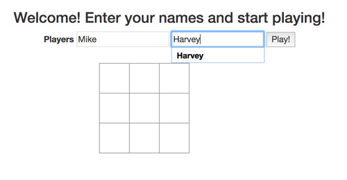
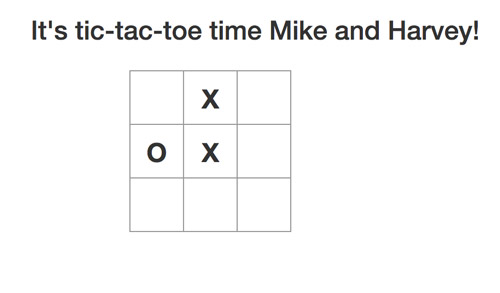
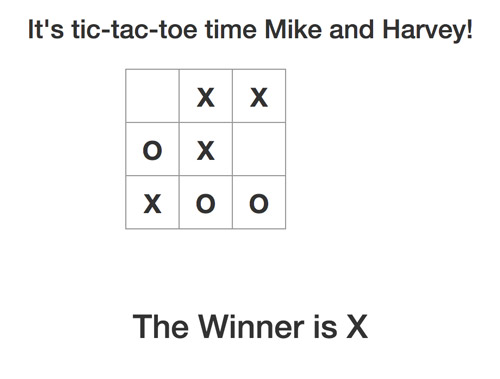

# Tic Tac Toe!

### Specifications

- There are two players in the game (X and O)
- A turn ends when a player claims a field
- A player can claim a field if it is not already taken
- Players take turns until the game is over
- A player wins if they claim all the fields in a row, column or diagonal
- A game is over if a player wins
- A game is over when all fields are taken
- Players can enter a name

### How to play Tic-Tac-Toe locally

```
$ git clone git@github.com:nenoch/tic-tac-toe.git

// open tic-tac-toe.html in the browser

```

### Screenshot

**Step #1**



**Step #2**



**Step #3**


