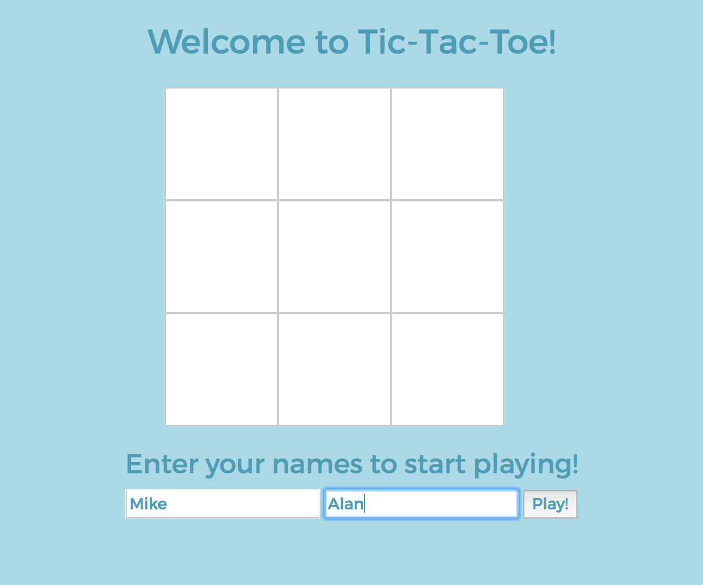
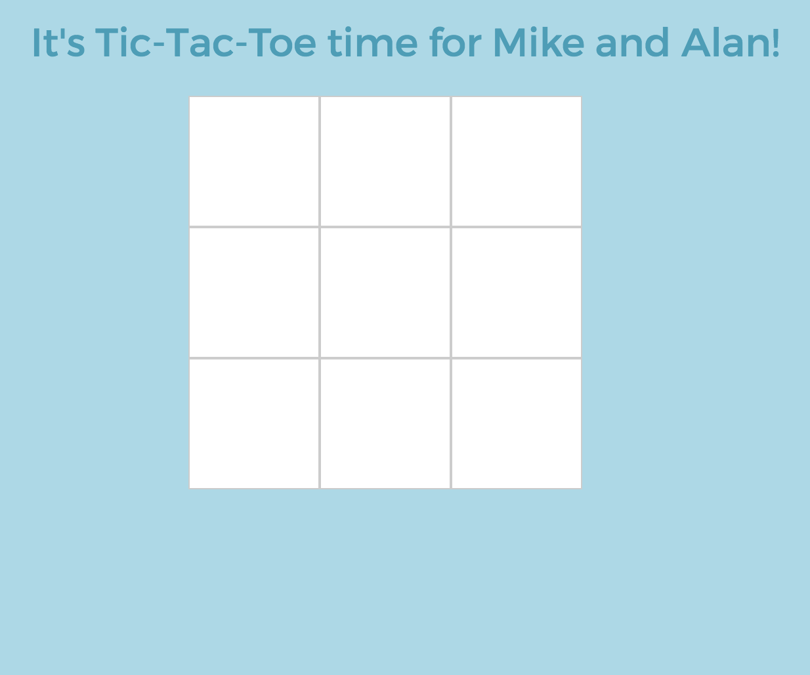
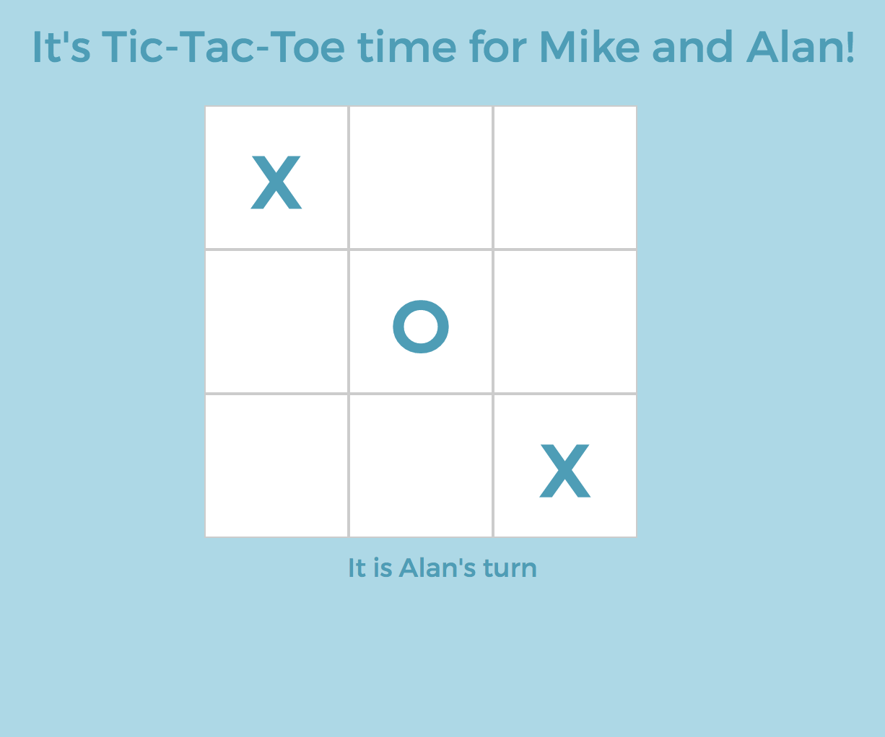

# Tic Tac Toe!

A simple tic-tac-toe game for 2 players.

### Specifications

- There are two players in the game (X and O)
- A turn ends when a player claims a field
- A player can claim a field if it is not already taken
- Players take turns until the game is over
- A player wins if they claim all the fields in a row, column or diagonal
- A game is over if a player wins
- A game is over when all fields are taken
- Players can enter their names

### Technology

- jQuery
- Javascript
- HTML5/CSS
- Bootstrap
- Testing Framework : **Jasmine**


To run the test suite:
```
$ git clone git@github.com:nenoch/tic-tac-toe.git

// open SpecRunner.html in the browser

```

### How to play Tic-Tac-Toe locally

```
$ git clone git@github.com:nenoch/tic-tac-toe.git

// open tic-tac-toe.html in the browser

```

### Interface

**Step #1**<div style="text-align:center"></div>


**Step #2**<div style="text-align:center"></div>

**Step #3**<div style="text-align:center"></div>

**Step #4**<div style="text-align:center"></div>

**Step #5**<div style="text-align:center"></div>
